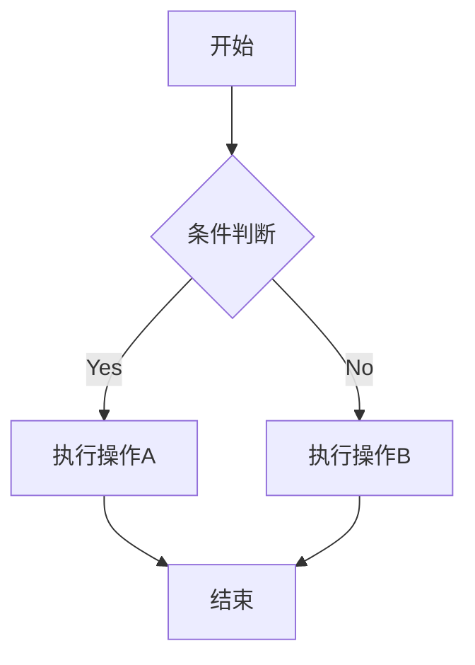

在这里用 **Typora 式** 所见即所得写 Markdown。

* 左侧管理文章、草稿和页面
* 顶部可切换源码 / Hexo 预览
* 登录 GitHub 后一键发布到 GitHub Pages

## 写作

支持标题、列表、引用、代码和图片。

```ts
console.log("publish with hexo");
```

> 预览来自真实的 `hexo generate`，不是前端 Markdown 渲染。



